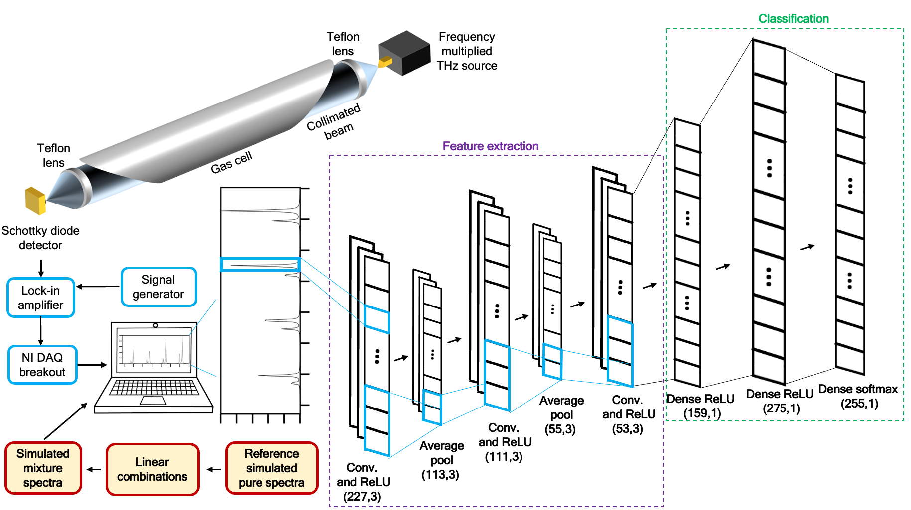

# TSMC-Net
THz Spectra of Mixtures Classification Network (TSMC-Net) in 220-330 GHz (7.33-11 1/cm) frequency range. The code and data for the network are stored here.

  

A deep learning/machine learning tool for classifying rotational/THz spectra of mixtures.

# Funding

This work was supported by the National Science Foundation under Grant CBET-1851291.

# Developer

M Arshad Zahangir Chowdhury

# Data and Supervision

Timothy E. Rice
Matthew A. Oehlschlaeger

# License

MIT License.

# Publication
Will be cited when available
